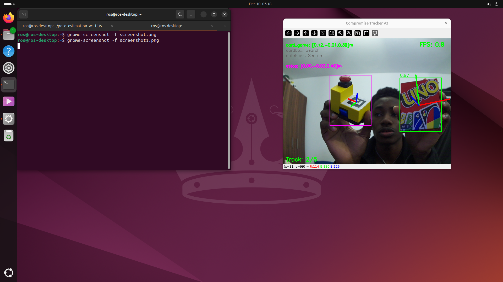

# Object Detection and Pose Estimation with ROS2 TF

Real-time 6DOF pose estimation system for multiple objects using Raspberry Pi camera. Detects objects, estimates their poses, and publishes coordinates as ROS2 TF frames for visualization in RViz.

[](https://docs.ros.org/en/jazzy/)
[](https://www.python.org/)
[](https://opencv.org/)
[](https://github.com/ultralytics/ultralytics)

---

## Table of Contents

- [Quick Links](#quick-links)
- [System Overview](#system-overview)
- [Key Features](#key-features)
- [Quick Start](#quick-start)
  - [Method 1: Quick Start on Raspberry Pi (Recommended)](#method-1-quick-start-on-raspberry-pi-recommended)
  - [Method 2: Quick Start via SSH (Remote Development)](#method-2-quick-start-via-ssh-remote-development)
- [Performance Metrics](#performance-metrics)
- [Development Journey](#development-journey)
- [Prerequisites](#prerequisites)
- [Tracked Objects](#tracked-objects)
- [Technical Approach](#technical-approach)
- [Optimization Techniques](#optimization-techniques)
- [Repository Structure](#repository-structure)
- [System Capabilities & Constraints](#system-capabilities--constraints)
- [Team & Authors](#team--authors)
- [Acknowledgments](#acknowledgments)

---

## Quick Links

| Resource | Description |
|----------|-------------|
| [Dataset](https://livemdxac-my.sharepoint.com/:f:/r/personal/ms3433_live_mdx_ac_uk/Documents/Datasets_Pose_Estimation?csf=1&web=1&e=2ZiRal) | Training/validation/test datasets (V1, V2, V3) - 22,893 images |
| [Presentation](Presentation/Gp2_Pose_Estimation_Presentation%20(Asse2).pptx) | Project presentation slides |

---

## System Overview

A real-time embedded vision system achieving 6DOF pose estimation for 5 objects simultaneously on Raspberry Pi 4. The system combines dual tracking methods (ArUco markers and markerless feature-based) with intelligent optimization to achieve practical performance on CPU-only hardware.

### Key Achievements

- **5 objects tracked simultaneously** with stable 6DOF pose estimation
- **Dual-method tracking**: 2 ArUco marker objects + 3 markerless feature-based objects
- **1.8-2.0 FPS** on Raspberry Pi 4 (5× improvement from 0.4 FPS via adaptive optimization)
- **98.5% detection accuracy** (mAP@0.5) with YOLOv8n trained on 22,893 images
- **ROS2 integration** with real-time TF frame broadcasting for RViz visualization
- **Modular architecture** supporting easy object/model swapping

### Detection & Tracking Methods

**ArUco-based (2 objects):**
- Direct marker detection with solvePnP
- Robust 6DOF pose from fiducial markers
- Objects: Phone, E-stop button

**Direct 3D Mapping (3 objects):**
- ORB feature extraction and matching
- Features mapped directly to 3D plane coordinates
- Temporal smoothing using previous pose as initial guess
- Objects: Card game, Green cardbox, Notebook

### Output

- 6DOF pose estimation (3D position + 3D orientation as quaternions)
- Real-time TF frame broadcasting to `/tf` topic
- Visual feedback with 3D coordinate axes overlay on camera feed
- Individual object frames: `[object_name]_frame` relative to `camera_link_G4`

---

## Key Features

- **Dual-method pose estimation** - Combines ArUco markers (robust) with markerless feature-based tracking (flexible)
- **Adaptive frame skipping** - Intelligent YOLO caching: processes every 3rd frame when stable, every frame when motion detected
- **Temporal pose smoothing** - Uses previous pose as initial guess for solvePnP, reducing frame-to-frame jitter
- **Modular architecture** - Easily swap detection models, add new objects, or change tracking methods
- **Automated camera calibration** - Checkerboard-based intrinsic calibration with parameter persistence
- **ROS2 native integration** - Direct TF2 broadcasting for seamless robotics ecosystem compatibility
- **Embedded optimization** - ONNX export support, reduced feature counts, efficient GStreamer pipeline
- **Object suitability testing** - Pre-deployment tool to validate objects for feature-based tracking
- **Comprehensive dataset tools** - Video collection, frame extraction, and auto-annotation pipeline included

---

## Quick Start

Get the system running in under 10 minutes. Choose your setup method:

---

### Method 1: Quick Start on Raspberry Pi (Recommended)

**Prerequisites:**
- Raspberry Pi 4 (4GB+ RAM recommended)
- Raspberry Pi Camera Module (V2 or V3)
- Ubuntu 24.04 with ROS2 Jazzy installed
- Monitor, keyboard, mouse connected to Pi

**Setup & Run:**

```bash
# 1. Clone repository
cd ~
git clone https://github.com/Shuaibu-oluwatunmise/PDE3802_Pose-Estimation.git

# 2. Run automated setup
cd ~/PDE3802_Pose-Estimation/Set_Up
bash setup_workspace.sh

# 3. Activate environment
source ~/.bashrc
init_env

# 4. Calibrate camera (first time only - use 9×6 checkerboard)
cd ~/pose_estimation_ws_t1/src/PDE3802_Pose-Estimation/Camera_Calibration
python3 Camera_Calibration.py

# 5. Create required __init__.py file
cd ~/pose_estimation_ws_t1/src/PDE3802_Pose-Estimation/Camera_Calibration/camera_calibration
touch __init__.py

# 6. Return to repository root
cd ~/pose_estimation_ws_t1/src/PDE3802_Pose-Estimation
```

**Launch Option A: Automated (Recommended)**

```bash
# Launches tracker + RViz automatically
python3 launch/pose_estimation.launch.py
```

**What happens:**
- Camera feed window opens showing live detection
- After 12 seconds, RViz launches automatically with pre-configured TF display
- System runs at 1.8-2.0 FPS tracking up to 5 objects

**Launch Option B: Manual**

```bash
# Terminal 1: Launch tracker
python3 main.py

# Terminal 2: Launch RViz (in new terminal)
init_env
rviz2
```

**Manual RViz Setup (Option B only):**
1. In RViz, set **Fixed Frame** to `camera_link_G4`:
   - Left panel → Global Options → Fixed Frame → Change from "map" to `camera_link_G4`
2. Add **TF Display**:
   - Click "Add" button → By display type → TF
   - Check "Show Axes" and "Show Names"
3. Set **Frame Rate** to 5:
   - Left panel → Global Options → Frame Rate → 5
4. Expected frames appear:
   - `camera_link_G4` (camera reference)
   - `card_game_frame`, `cardbox_frame`, `notebook_frame`, `phone_frame`, `estop_frame`

**Controls:**
- Press `r` to reset feature tracking calibrations
- Press `q` to quit

---

### Method 2: Quick Start via SSH (Remote Development)

**Prerequisites:**
- Raspberry Pi 4 with camera (set up as above)
- Laptop/PC on the same network
- SSH access to Raspberry Pi

**Get Raspberry Pi IP Address:**

On the Raspberry Pi:
```bash
hostname -I
```
Note the IP address (e.g., `192.168.1.100`)

**Setup on Pi (via SSH):**

```bash
# SSH into Raspberry Pi from laptop
ssh ros@<pi-ip-address>

# Follow steps 1-6 from Method 1 above (clone, setup, calibrate, __init__.py)
# Then return to repository root
cd ~/pose_estimation_ws_t1/src/PDE3802_Pose-Estimation
```

**Launch System:**

```bash
# On SSH terminal (laptop): Launch tracker
init_env
python3 main.py
```

**Launch RViz (on Raspberry Pi):**

Since SSH cannot display GUI applications, open a terminal directly on the Raspberry Pi (via connected monitor/keyboard):

```bash
# On Pi terminal (connected monitor/keyboard):
init_env
rviz2
```

Then follow the **Manual RViz Setup** steps from Method 1 (Option B) above.

---

**Note:** For detailed installation instructions, troubleshooting, and advanced configuration, see the [Prerequisites](#prerequisites) section below.

---

## Performance Metrics

### System Performance

- **Frame Rate:** 1.8-2.0 FPS on Raspberry Pi 4 (4GB RAM)
- **Optimization Impact:** 5× improvement (0.4 → 2.0 FPS) via adaptive frame skipping
- **Objects Tracked:** 5/5 simultaneous (2 ArUco + 3 markerless)
- **Pose Stability:** Minimal jitter achieved through direct 3D mapping and temporal smoothing
- **Hardware:** Raspberry Pi 4 with Camera Module V2, CPU-only inference

### YOLOv8n Detection Model (V3 - Deployment)

**Training Configuration:**
- **Architecture:** YOLOv8n (nano - optimized for embedded deployment)
- **Dataset:** 22,893 images, 24,010 labeled instances
- **Training Split:** 18,315 train / 2,289 val / 2,289 test
- **Class Distribution:** Balanced (~4,800 instances per class)
- **Epochs:** 100 (early stopping at patience=10)
- **Image Size:** 640×640
- **Batch Size:** 32

**Detection Accuracy:**

| Metric | Value |
|--------|-------|
| **mAP@0.5** | **98.52%** |
| **mAP@0.5-0.95** | **97.19%** |
| **Precision** | **98.98%** |
| **Recall** | **96.79%** |

**Per-Class Performance (AP@0.5):**

| Object | AP@0.5 | Notes |
|--------|--------|-------|
| **Cardbox** | 99.5% | Best performing class |
| **Phone** | 99.3% | ArUco marker object |
| **Card Game** | 99.0% | Feature-based tracking |
| **Notebook** | 97.5% | Feature-based tracking |
| **E-stop** | 97.3% | ArUco marker object |

### Training Curves


*Training progression showing convergence of box loss, classification loss, and mAP metrics over 100 epochs.*

### Confusion Matrix


**Key Observations:**
- **Minimal false positives:** Only 71 background predictions across 2,417 validation instances (2.9%)
- **Strong class separation:** All classes achieve >95% recall
- **Balanced performance:** No significant class bias, all objects detected reliably

**Note:** Four YOLO models were trained (YOLOv5n-V1, YOLOv8n-V1/V2/V3). V3 was selected as the deployment model. For detailed comparison of all model versions, see [Model Analysis](runs/detect/MODEL_ANALYSIS.md).

---

## Development Journey

The project evolved through three distinct approaches before arriving at the final system, each providing valuable insights into pose estimation challenges on embedded hardware.

### Approach 1: Keypoint Detection (YOLOv8-pose)

**Objective:** Train a YOLO-pose model to directly predict object keypoints and compute pose from keypoint correspondences.

**Implementation:**
- Trained YOLOv8-pose on Rubik's Cube dataset
- Dataset: 120 images (with augmentation)
- Manual keypoint annotation using RoboFlow

**Results:**
- Detection: Unstable bounding boxes, frequent false positives
- Keypoint/Pose: Near-zero accuracy across all metrics (F1, precision, recall)
- Model showed clear signs of overfitting to small dataset

**Lessons Learned:**
- Pose learning requires massive datasets (1000s of annotated images per object)
- Rubik's Cube's repeating patterns caused confusion
- Manual keypoint annotation is extremely time-consuming and error-prone
- Small dataset (120 images) fundamentally insufficient for pose branch learning

**Decision:** Pivoted to geometry-based approaches requiring no pose-specific training data.

---

### Approach 2: Homography-based Pose Estimation

**Objective:** Use feature matching and homography transformation to estimate pose for planar objects.

**Implementation:**
- YOLO detects object bounding box
- ORB feature extraction within detected region
- Feature matching between live frame and reference image
- Homography matrix computation (RANSAC)
- Pose derived from homography via PnP solver

**Results:**
- Successfully tracked 2 objects (Notebook, Game box)
- Failed on Repair mat due to insufficient texture density
- Frame-to-frame jitter present despite successful tracking

**Challenge Identified:**
Homography introduces intermediate geometric transformation, accumulating errors and causing pose instability.

**Key Insight:**
Not all visually textured objects provide sufficient feature density for reliable homography computation. Introduced object suitability testing tool to validate objects before full training.

---

### Approach 3: Direct 3D Mapping (Final Solution)

**Objective:** Eliminate homography step by mapping features directly to 3D plane coordinates.

**Implementation:**
1. YOLO detects object bounding box
2. ORB features extracted from reference image
3. **Features mapped directly to 3D plane** using object physical dimensions
4. Live features matched against reference features
5. solvePnP computes 6DOF pose using 3D-to-2D correspondences
6. **Previous pose used as initial guess** for temporal smoothing

**Key Improvement:**
By skipping the 2D homography transformation and going straight from 3D object points to 2D image points, geometric errors are reduced and pose stability improves significantly.

**Results:**
- Successfully tracks 3 markerless objects with minimal jitter
- Temporal smoothing (using previous pose as initial guess) provides frame-to-frame consistency
- Combined with ArUco markers for 5-object simultaneous tracking
- Stable enough for real-time ROS2 TF broadcasting

**Final System:**
- 3 objects: Direct 3D mapping (Card game, Cardbox, Notebook)
- 2 objects: ArUco markers (Phone, E-stop)
- Modular architecture allows easy method swapping per object

---

## Prerequisites

### Hardware Requirements

**Essential:**
- **Raspberry Pi 4** (4GB RAM recommended, 2GB minimum)
- **Raspberry Pi Camera Module** (V2 or V3 via CSI interface)
- **MicroSD Card** (32GB+, Class 10 or UHS-I)
- **Power Supply** (5V 3A USB-C for stable operation)

**For Initial Setup:**
- Monitor (HDMI)
- Keyboard and mouse (USB)
- Ethernet cable or WiFi connection

**For SSH Operation:**
- Laptop/PC on the same network
- SSH client (built-in on Linux/Mac, PuTTY/Windows Terminal on Windows)

### Software Requirements

**Operating System:**
- Ubuntu 24.04 (64-bit) for Raspberry Pi
- ROS2 Jazzy Jalisco (tested and verified)

**Python:**
- Python 3.10 or higher (comes with Ubuntu 24.04)
- Virtual environment support

**Required Libraries:**
- OpenCV 4.x with ArUco module
- Ultralytics YOLOv8
- ROS2 Python packages (rclpy, tf2_ros)
- NumPy
- GStreamer 1.0 with libcamera support

**Camera Calibration Tool:**
- 9×6 checkerboard pattern (printed on flat surface, 25mm squares recommended)

### Network Requirements

**For SSH/Remote Operation:**
- Raspberry Pi and laptop must be on the same local network
- Stable network connection (WiFi or Ethernet)
- SSH port 22 accessible

**For ROS2 Operation:**
- ROS_DOMAIN_ID configured (default: 0)
- Multicast enabled on network (for ROS2 discovery)

### Storage Requirements

- **System + ROS2:** ~8GB
- **Repository + Dependencies:** ~2GB
- **Trained Models:** ~50MB
- **Calibration Data:** ~10MB
- **Recommended Free Space:** 5GB+ for comfortable operation

### Performance Expectations

The system is optimized for Raspberry Pi 4 but has hardware limitations:
- **Expected FPS:** 1.8-2.0 with adaptive frame skipping
- **YOLO Inference Time:** 150-300ms per frame on CPU
- **Bottleneck:** CPU-bound object detection (no GPU acceleration)

Higher frame rates require hardware acceleration (Coral TPU, Jetson Nano) or architecture changes.

---

## Tracked Objects

The system tracks 5 objects simultaneously using two different pose estimation methods. Physical dimensions are critical for accurate 3D pose reconstruction.

### Object Specifications

| Object | Method | Dimensions | ArUco ID | Dictionary | Notes |
|--------|--------|------------|----------|------------|-------|
| **Card Game** | Direct 3D Mapping | 93 × 115 mm | - | - | Card deck box, rich texture |
| **Green Cardbox** | Direct 3D Mapping | 240 × 130 mm | - | - | Storage box, high contrast features |
| **Notebook** | Direct 3D Mapping | 147 × 209 mm | - | - | A5 notebook, grid pattern |
| **Phone** | ArUco Marker | 36.5 mm marker | 0 | DICT_4X4_50 | Marker displayed on screen |
| **E-Stop Button** | ArUco Marker | 30 mm marker | 1 | DICT_4X4_50 | Marker affixed to button |

### Object Selection Criteria

**For Direct 3D Mapping (Markerless):**
- **Planar surface:** Object must have a flat, identifiable face
- **Rich texture:** High-contrast features with distinctive patterns (edges, text, logos)
- **Sufficient size:** Minimum ~90mm in smallest dimension for reliable feature detection
- **Texture contrast:** Strong gradients for ORB feature detection (avoid plain/uniform surfaces)

**For ArUco Markers:**
- **Any object:** Markers work on any surface regardless of texture
- **Marker visibility:** Marker must remain unoccluded during tracking
- **Marker size:** Larger markers = more robust detection at distance

### Object Suitability Testing

Before training a new object for markerless tracking, use the suitability testing tool:

```bash
cd ~/pose_estimation_ws_t1/src/PDE3802_Pose-Estimation/legacy
python3 suitability.py
```

This script evaluates:
- Feature density (ORB keypoint count)
- Feature match quality against reference frames
- Temporal stability of feature matching

Objects with insufficient texture will be flagged before committing to full dataset creation.

### System Performance


*Card game and notebook tracked simultaneously with 6DOF pose estimation and coordinate axes visualization.*


*Camera feed (left) and RViz TF frame display (right) showing real-time pose broadcasting for card game and e-stop button.*


*E-stop button (ArUco) and card game (markerless) tracked together, demonstrating dual-method system capability.*

---

## Technical Approach

The system combines YOLO-based object detection with two complementary pose estimation methods, enabling robust tracking across different object types.

### Detection Pipeline

**YOLOv8n Object Detector:**
1. Camera frame captured via GStreamer pipeline (640×480 @ 30fps target)
2. YOLO inference detects all 5 objects with bounding boxes and confidence scores
3. Detections filtered by confidence threshold (>0.55)
4. Bounding boxes define regions of interest (ROIs) for pose estimation

**Adaptive Frame Skipping:**
- YOLO runs on every 3rd frame when objects are stable (cached detections used)
- YOLO runs on every frame when motion detected (>30px bbox movement)
- Reduces computational load while maintaining tracking accuracy

---

### Pose Estimation Methods

#### Method 1: ArUco Marker-Based (2 objects)

**Process:**
1. YOLO provides object bounding box
2. ArUco detector searches for marker within ROI
3. Marker corners extracted (4 points)
4. solvePnP computes 6DOF pose using known marker size

**Advantages:**
- Extremely robust and reliable
- Works on any object (no texture requirements)
- High accuracy with minimal computation

**Implementation:**
```python
marker_size = 0.0365  # meters (phone)
object_points = np.array([
    [-marker_size/2,  marker_size/2, 0],
    [ marker_size/2,  marker_size/2, 0],
    [ marker_size/2, -marker_size/2, 0],
    [-marker_size/2, -marker_size/2, 0]
])
success, rvec, tvec = cv2.solvePnP(
    object_points, marker_corners, 
    camera_matrix, dist_coeffs, 
    flags=cv2.SOLVEPNP_IPPE_SQUARE
)
```

---

#### Method 2: Direct 3D Mapping (3 objects)

**Process:**
1. YOLO detects object bounding box
2. ORB features extracted from reference image (captured during stable detection)
3. **Features mapped directly to 3D plane coordinates** using physical object dimensions
4. Live features extracted and matched against reference features
5. solvePnP computes 6DOF pose from 3D-to-2D correspondences
6. **Previous pose used as initial guess** for temporal smoothing

**Key Innovation - Direct 3D Mapping:**

Traditional homography approach:
```
2D features → 2D homography → Corner transformation → PnP
```

Our direct mapping approach:
```
2D features → Direct 3D plane mapping → PnP with temporal smoothing
```

**How it works:**
```python
# Map 2D keypoint (u, v) to 3D plane point (X, Y, 0)
scale_x = object_width / bbox_width
scale_y = object_height / bbox_height

X = (u * scale_x) - (object_width / 2.0)   # Center at origin
Y = (-v * scale_y) + (object_height / 2.0)  # Flip Y axis
plane_ref.append([X, Y, 0.0])               # Z = 0 (planar)
```

Each reference feature now has:
- 2D image coordinates (u, v) for matching
- 3D object coordinates (X, Y, 0) for pose estimation

**Temporal Smoothing:**
```python
# Use previous pose as initial guess
success, rvec, tvec, inliers = cv2.solvePnPRansac(
    object_points_3d, 
    image_points_2d,
    camera_matrix, 
    dist_coeffs,
    useExtrinsicGuess=True,      # Enable initial guess
    rvec=previous_rvec,           # Previous rotation
    tvec=previous_tvec,           # Previous translation
    iterationsCount=50,
    reprojectionError=8.0,
    confidence=0.99
)
```

**Advantages:**
- Eliminates intermediate homography transformation (reduces geometric errors)
- Temporal smoothing provides frame-to-frame consistency
- No training data required (geometry-based)
- Adapts to any planar, textured object

**Requirements:**
- Sufficient feature density (15+ ORB keypoints)
- Stable reference frame (object held still during initial detection)
- Texture-rich surface (edges, patterns, contrast)

---

### Camera Calibration

Accurate pose estimation requires camera intrinsic parameters:

**Calibration provides:**
- Focal length (fx, fy)
- Principal point (cx, cy)
- Radial distortion coefficients (k1, k2, k3)
- Tangential distortion coefficients (p1, p2)

**Used in:**
- solvePnP for 3D-to-2D projection
- Undistortion (optional) for improved feature matching
- Coordinate transformation from image plane to 3D space

---

### ROS2 Integration

**TF2 Frame Broadcasting:**

Static transform (published once at startup):
```
map → camera_link_G4 (fixed reference frame)
```

Dynamic transforms (published at detection rate):
```
camera_link_G4 → card_game_frame
camera_link_G4 → cardbox_frame
camera_link_G4 → notebook_frame
camera_link_G4 → phone_frame
camera_link_G4 → estop_frame
```

**Transform Format:**
- Translation: (x, y, z) in meters relative to camera
- Rotation: Quaternion (x, y, z, w) converted from rotation vector

All transforms published to `/tf` topic for RViz visualization and downstream robotics applications.

---

## Optimization Techniques

Achieving real-time performance on Raspberry Pi 4's CPU required aggressive optimization. The system implements multiple strategies to maximize frame rate without sacrificing tracking accuracy.

### Adaptive Frame Skipping

**The Problem:**
YOLO inference is the primary bottleneck, consuming 150-300ms per frame on Raspberry Pi 4 CPU. Running YOLO on every frame limits the system to 3-5 FPS maximum.

**The Solution:**
Intelligent detection caching based on object motion:

```python
BASE_SKIP_FRAMES = 3        # Process every 3rd frame when stable
FAST_SKIP_FRAMES = 1        # Process every frame when motion detected
MOTION_THRESHOLD = 30       # Pixel movement to trigger fast mode
```

**How it works:**

1. **Motion Detection:**
   - Track bounding box center positions between frames
   - Calculate pixel distance moved: `distance = sqrt((x2-x1)² + (y2-y1)²)`
   - If distance > 30 pixels: Motion detected

2. **Adaptive Processing:**
   - **Objects stable:** Run YOLO every 3rd frame, cache detections for frames 2 and 3
   - **Objects moving:** Run YOLO every frame for accurate tracking
   - **Mixed scenario:** System adapts per-object (some cached, some fresh)

3. **Cache Management:**
   - Cached detections include bounding box, confidence score, class
   - ArUco detection and pose estimation still run every frame (lightweight)
   - Only YOLO inference is skipped

**Performance Impact:**
- **Before optimization:** 0.4 FPS (YOLO every frame)
- **After optimization:** 1.8-2.0 FPS (adaptive skipping)
- **Improvement:** 5× speedup

**Trade-off:**
Minimal accuracy loss - objects detected slightly later when suddenly appearing, but pose estimation remains stable once detected.

---

### Temporal Pose Smoothing

**The Problem:**
Feature matching can produce frame-to-frame variations causing pose jitter, even when object is stationary.

**The Solution:**
Use previous pose as initial guess for solvePnP:

```python
success, rvec, tvec, inliers = cv2.solvePnPRansac(
    object_points, image_points,
    camera_matrix, dist_coeffs,
    useExtrinsicGuess=True,      # Enable previous pose
    rvec=previous_rvec,          # Last known rotation
    tvec=previous_tvec,          # Last known translation
    iterationsCount=50,
    reprojectionError=8.0
)
```

**Benefits:**
- Converges faster (fewer RANSAC iterations needed)
- Reduces jitter by biasing toward previous solution
- Maintains smooth TF frame motion in RViz
- Handles partial occlusion better (fewer features needed)

---

### ONNX Model Export

**Optional optimization for further speedup:**

```bash
# Export YOLO model to ONNX format
yolo export model=runs/detect/yolov8n_detect_V3/weights/best.pt format=onnx

# System automatically uses ONNX if available
# Falls back to PyTorch (.pt) if ONNX not found
```

**Performance gain:** 10-15% faster inference on Raspberry Pi CPU

**Trade-off:** Slightly larger model file size, but negligible impact on embedded storage

---

### Reduced Feature Count

**Configuration:**
```python
ORB_FEATURES = 2000          # Features to extract per frame
MIN_FEATURES = 15            # Minimum for reference creation
MIN_MATCH_COUNT = 10         # Minimum matches for pose estimation
MIN_PNP_POINTS = 6           # Minimum points for solvePnP
MIN_PNP_INLIERS = 6          # Minimum inliers after RANSAC
```

**Strategy:**
- Extract 2000 ORB features (sufficient for most textured objects)
- Require only 15+ features for reference (avoids over-constraining)
- Accept poses with 6+ inliers (balances accuracy and robustness)

**Impact:**
Faster feature extraction without sacrificing pose quality on well-textured objects.

---

### GStreamer Pipeline Optimization

**Camera configuration:**
```python
gst_str = (
    "libcamerasrc ! "
    "video/x-raw,width=640,height=480,format=NV12,framerate=30/1 ! "
    "videoconvert ! video/x-raw,format=BGR ! "
    "appsink emit-signals=true max-buffers=1 drop=true"
)
```

**Key settings:**
- `max-buffers=1`: Prevents frame queue buildup
- `drop=true`: Drops frames if processing is slow (avoids lag)
- 640×480 resolution: Balance between detection accuracy and processing speed

---

### Threaded Camera Acquisition

**Implementation:**
Camera runs in separate thread, continuously updating latest frame:

```python
class ThreadedCamera:
    def _on_new_sample(self, sink):
        # Runs in background thread
        with self.lock:
            self.frame = new_frame.copy()
    
    def read(self):
        # Main thread reads latest frame
        with self.lock:
            return self.frame.copy()
```

**Benefits:**
- Camera acquisition doesn't block main processing loop
- Always have latest frame available (no frame skipping due to processing delay)
- Smooth frame capture even when YOLO inference is running

---

### Future Optimization Opportunities

**Hardware Acceleration:**
- **Coral TPU:** 10-20× YOLO speedup possible (USB or M.2 module)
- **Jetson Nano:** GPU-accelerated inference (30+ FPS achievable)
- **Hailo AI accelerator:** Dedicated AI inference chip

**Software Improvements:**
- **C++ implementation:** Eliminate Python overhead (2-3× speedup)
- **TensorRT optimization:** GPU-specific model optimization
- **Lightweight architectures:** YOLOv5-nano, YOLOv8-nano quantized models

**Current bottleneck:** Raspberry Pi 4 CPU has reached practical limits for YOLO inference. Further gains require hardware acceleration.

---

## Repository Structure

```
PDE3802_Pose-Estimation/
├── main.py                          # Main entry point - pose estimation system
├── launch/
│   └── pose_estimation.launch.py    # ROS2 launch file (auto-starts RViz)
├── config/
│   └── pose_estimation.rviz         # Pre-configured RViz settings
│
├── Camera_Calibration/
│   ├── Camera_Calibration.py        # Calibration script (9×6 checkerboard)
│   └── camera_calibration/
│       ├── camera_params.py         # Intrinsic parameters (auto-generated)
│       └── images/                  # Calibration images
│
├── Detection/
│   └── train.py                     # YOLO training script
│
├── Data_Preparation/
│   ├── video_data_collection.py     # Record calibration videos
│   ├── extract_frames.py            # Extract frames from videos
│   └── auto_annotation.py           # Automated labeling pipeline
│
├── runs/detect/
│   ├── yolov5n_detect_V1/           # YOLOv5 experimental model
│   ├── yolov8n_detect_V1/           # YOLOv8 first iteration
│   ├── yolov8n_detect_V2/           # YOLOv8 second iteration
│   └── yolov8n_detect_V3/           # YOLOv8 deployment model (BEST)
│       └── weights/
│           ├── best.pt              # PyTorch model
│           └── best.onnx            # ONNX optimized model
│
├── Set_Up/
│   ├── setup_workspace.sh           # Automated installation script
│   └── requirements.txt             # Python dependencies
│
├── Demo_Versions/                   # Development iterations
├── legacy/                          # Earlier experimental code
├── Presentation/                    # Project presentation slides
└── picture_results/                 # System performance images
```

---

## System Capabilities & Constraints

### Achieved Capabilities

- Real-time tracking at 1.8-2.0 FPS on embedded hardware (Raspberry Pi 4)
- 5× FPS improvement through adaptive optimization (0.4 → 2.0 FPS)
- Stable 6DOF pose estimation for textured planar objects
- Dual-method tracking (ArUco markers + markerless feature-based)
- 98.5% detection accuracy (mAP@0.5) with balanced dataset
- Seamless ROS2 integration with TF2 broadcasting

### Hardware Constraints

- **CPU-bound inference:** Raspberry Pi 4 CPU reaches practical limits for real-time YOLO
- **Frame rate ceiling:** 1.8-2.0 FPS maximum without hardware acceleration
- **Higher performance requires:** Coral TPU, Jetson Nano, or dedicated AI accelerator

### Object Requirements

**Markerless tracking requires:**
- Planar surfaces with rich texture (edges, patterns, high contrast)
- Sufficient feature density (15+ ORB keypoints)
- Minimum size ~90mm for reliable detection

**ArUco markers:**
- Universal tracking for any object regardless of texture
- Marker must remain visible and unoccluded

### Known Limitations

- Frame-to-frame jitter minimized but not eliminated (acceptable for most robotics applications)
- Markerless tracking fails on low-texture objects (plain surfaces, uniform colors)
- Performance degrades in poor lighting conditions (affects both detection and feature matching)

---

## Team & Authors

**Oluwatunmise Raphael Shuaibu** - M00960413  
Lead developer, system architecture, optimization

**Myu Wai Shin** - M00964135  
Dataset creation, testing, documentation

**Arash Bazrafshan** - M00766882  
ROS2 integration, RViz configuration

**Course:** PDE3802 - AI in Robotics  
**Institution:** Middlesex University London  
**Date:** December 2024

**Note:** This project involved collaborative development with overlapping contributions across all areas. Individual commits reflect work distribution but all members contributed to research, implementation, and testing.

---

## Acknowledgments

Special thanks to:
- Course instructors and teaching staff at Middlesex University London for guidance and support
- ROS2 and Ultralytics communities for excellent documentation
- OpenCV contributors for robust computer vision libraries

---