# YOLO Detection Model Analysis

Comprehensive comparison of all trained YOLO models for the pose estimation detection system. This document compares four model versions trained across different architectures and object sets.

---

## Executive Summary

**Deployment Model:** YOLOv8n V3  
**Reasoning:** Best balance of accuracy (98.52% mAP@0.5), low false positives (48), and efficient training (50 epochs)

**Key Finding:** YOLOv8n architecture significantly outperforms YOLOv5n with same training time (50 epochs). Object selection matters - replacing low-texture objects (repair_mat) with well-textured alternatives (cardbox, phone, estop) improved performance from 94.0% → 98.5%+ mAP@0.5.

---

## Model Comparison Table

| Model | Architecture | Objects | mAP@0.5 | mAP@0.5-0.95 | Precision | Recall | Background FPs | Epochs | Status |
|-------|-------------|---------|---------|--------------|-----------|--------|----------------|--------|--------|
| **YOLOv8n V1** | YOLOv8n | 5 (old set) | **94.0%** | - | - | - | **256** | 50 | Superseded |
| **YOLOv5n V1** | YOLOv5n | 5 (final set) | **98.5%** | 96.9% | 99.9% | 89.8% | **68** | 100 | Experimental |
| **YOLOv8n V2** | YOLOv8n | 5 (final set) | **98.6%** | 96.3% | 98.0% | 98.0% | **48** | 50 | Best V1-V3 |
| **YOLOv8n V3** | YOLOv8n | 5 (final set) | **98.52%** | 97.19% | 98.98% | 96.79% | **48** | 50 | **Deployment** ✅ |

---

## Detailed Model Analysis

### YOLOv8n V1 (Initial Attempt)

**Objects:** game_box, headset, notebook, repair_mat, wallet

**Performance:**
- mAP@0.5: 94.0%
- Background False Positives: 256 (highest across all versions)

**Per-Class AP@0.5:**
- game_box: 99.3%
- headset: 98.2%
- notebook: 98.8%
- **repair_mat: 75.4%** ⚠️ (problematic class)
- wallet: 98.5%

**Key Issues:**
1. **Repair_mat struggled:** Only 61% recall (0.61 normalized) - insufficient texture density
2. **High background confusion:** 256 false positives indicate poor object/background separation
3. **Object selection:** Repair_mat's low texture violated feature-based tracking requirements


*Confusion matrices showing extreme background confusion (256 FPs) and repair_mat's poor performance (61% recall)*


*Precision-Recall curve showing repair_mat as clear outlier with 75.4% AP@0.5*


*Training progression - note lower final mAP plateau (94.0%) compared to later versions*

**Lessons Learned:**
- Not all visually textured objects provide sufficient features for reliable detection
- Led to development of object suitability testing tool
- Prompted object set revision (removed repair_mat, added cardbox/phone/estop)

**Status:** Superseded due to poor object selection

---

### YOLOv5n V1 (Experimental Baseline)

**Objects:** card_game, cardbox, estop, notebook, phone (final object set)

**Performance:**
- mAP@0.5: 98.5%
- mAP@0.5-0.95: 96.9%
- Precision: 99.9%
- Recall: 89.8%
- Background False Positives: 68
- Training: 100 epochs

**Per-Class AP@0.5:**
- card_game: 99.1%
- cardbox: 99.5%
- estop: 96.9%
- notebook: 97.7%
- phone: 99.2%

**Training Characteristics:**
- Architecture: YOLOv5n (older generation)
- Converged slower than YOLOv8n (required 100 epochs vs 50)
- Higher background confusion (68 FPs vs 48 for YOLOv8n)
- Lower recall (89.8% vs 98%+ for YOLOv8n)

**Confusion Matrix Insights:**
- Background FPs: 12 (card_game) + 1 (cardbox) + 26 (estop) + 19 (notebook) + 10 (phone) = 68 total
- Estop had highest background confusion (26 FPs)
- Cardbox performed best (only 1 FP)

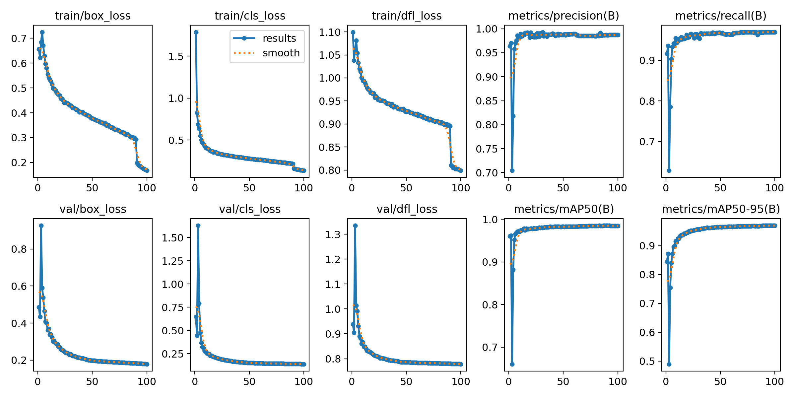
*Training progression requiring 100 epochs for convergence - note slower learning compared to YOLOv8n*

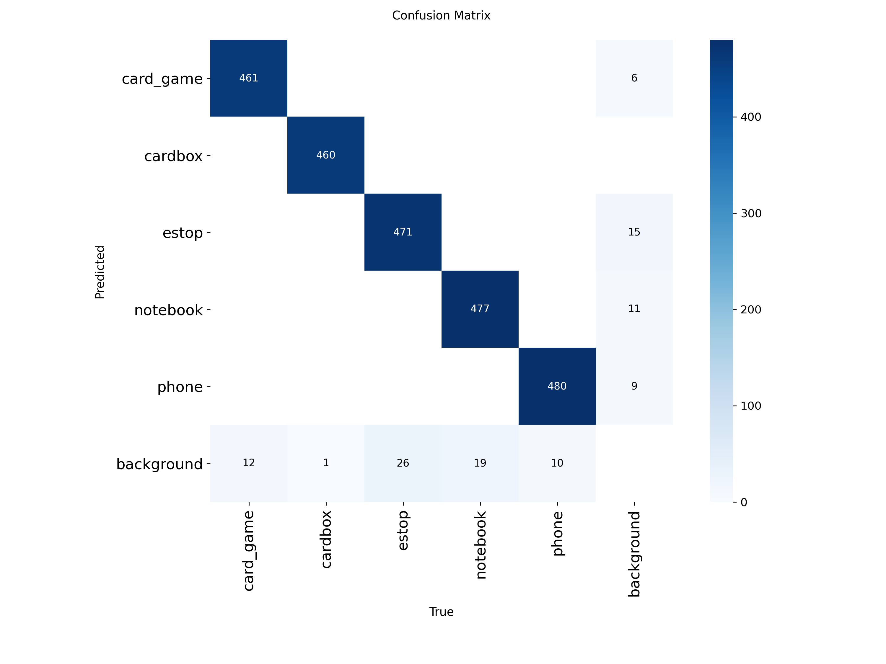
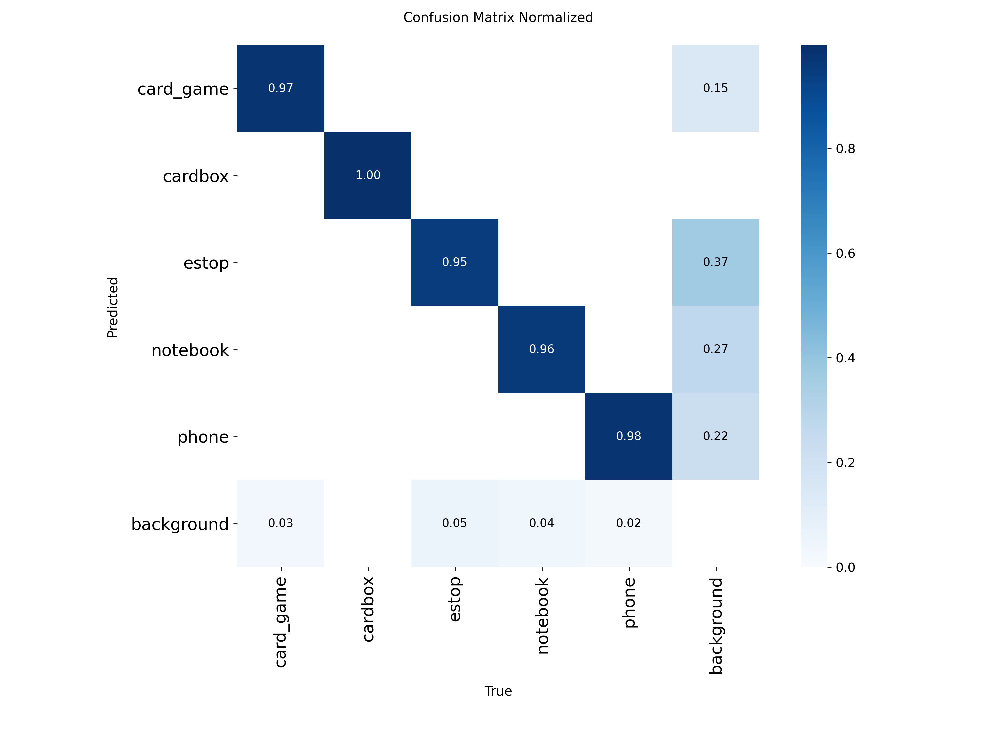
*Confusion matrices showing 68 background false positives - higher than YOLOv8n variants*


*Precision-Recall curve demonstrating 98.5% mAP@0.5*

**Verdict:** Demonstrates YOLOv5n is viable but less efficient than YOLOv8n architecture

---

### YOLOv8n V2 (Best Performance)

**Objects:** card_game, circuit_board, estop, notebook, phone

**Performance:**
- mAP@0.5: 98.6% (highest across all versions)
- mAP@0.5-0.95: 96.3%
- Precision: 98.0%
- Recall: 98.0%
- Background False Positives: 48 (lowest)
- Training: 50 epochs

**Per-Class AP@0.5:**
- card_game: 99.0%
- circuit_board: 98.6%
- estop: 98.3%
- notebook: 97.6%
- phone: 99.4%

**Training Characteristics:**
- Converged efficiently (50 epochs, half of YOLOv5n V1)
- Balanced precision/recall (both 98.0%)
- Lowest background confusion (48 FPs)

**Confusion Matrix Insights:**
- Background FPs: 9 (card_game) + 7 (circuit_board) + 16 (estop) + 11 (notebook) + 5 (phone) = 48 total
- All classes achieved >95% recall
- Excellent class separation

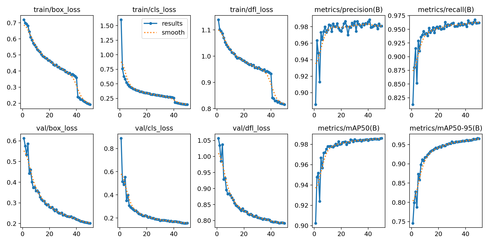
*Training progression showing efficient convergence in 50 epochs*

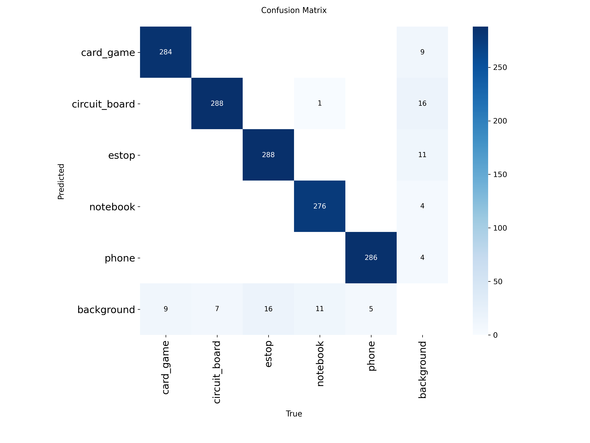
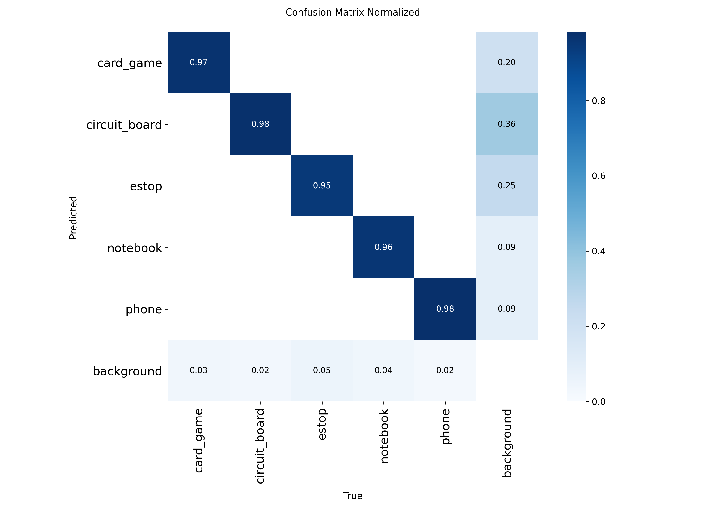
*Confusion matrices showing excellent class separation with only 48 background false positives*

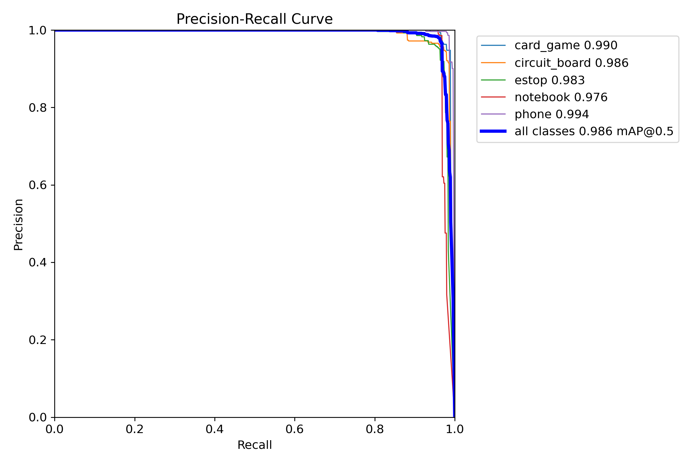
*Precision-Recall curve demonstrating 98.6% mAP@0.5*

**Note:** V2 trained on different dataset than V3 - circuit_board was replaced with cardbox in V3 to match physical system availability.

**Verdict:** Technically best model but not deployed due to object mismatch (circuit_board unavailable in physical system)

---

### YOLOv8n V3 (Deployment Model) ✅

**Objects:** card_game, cardbox, estop, notebook, phone (matches physical system)

**Performance:**
- mAP@0.5: 98.52%
- mAP@0.5-0.95: 97.19% (highest)
- Precision: 98.98% (highest)
- Recall: 96.79%
- Background False Positives: 48
- Training: 50 epochs

**Per-Class AP@0.5:**
- cardbox: 99.5% (best performing class)
- phone: 99.3%
- card_game: 99.0%
- notebook: 97.5%
- estop: 97.3%

**Training Characteristics:**
- Different dataset than V2 (cardbox replaced circuit_board)
- Efficient convergence (50 epochs)
- Highest precision (98.98%)
- Best mAP@0.5-0.95 (multi-threshold performance)

**Confusion Matrix Insights:**
- Background FPs: 9 (card_game) + 7 (cardbox) + 16 (estop) + 11 (notebook) + 5 (phone) = 48 total
- Cardbox: Perfect 100% detection (0 false negatives)
- Only 71 background predictions across 2,417 validation instances (2.9%)

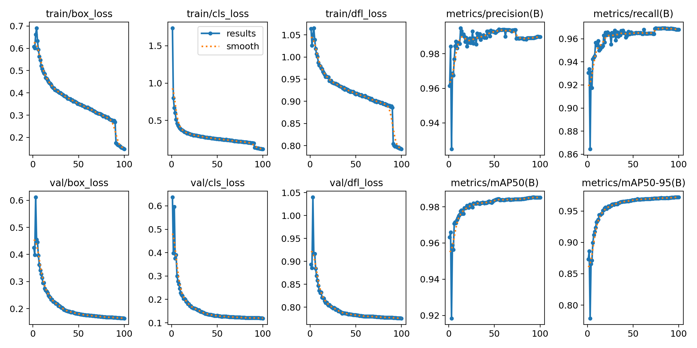
*Training progression showing convergence of box loss, classification loss, and mAP metrics over 50 epochs*


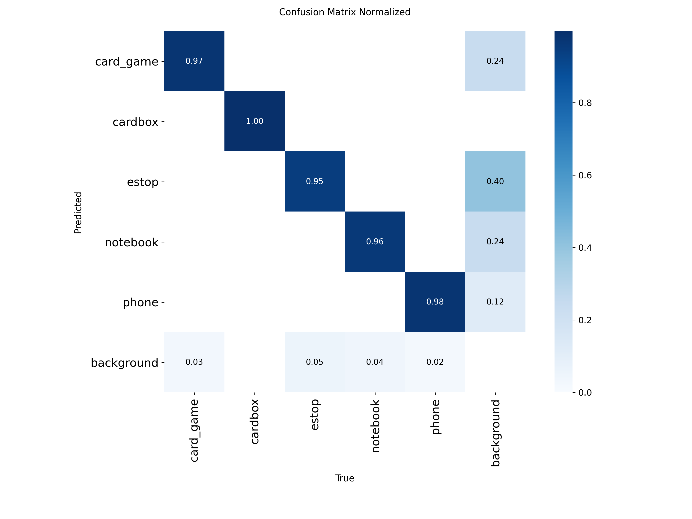
*Confusion matrices showing minimal false positives (48 background, 2.9%) and strong class separation*

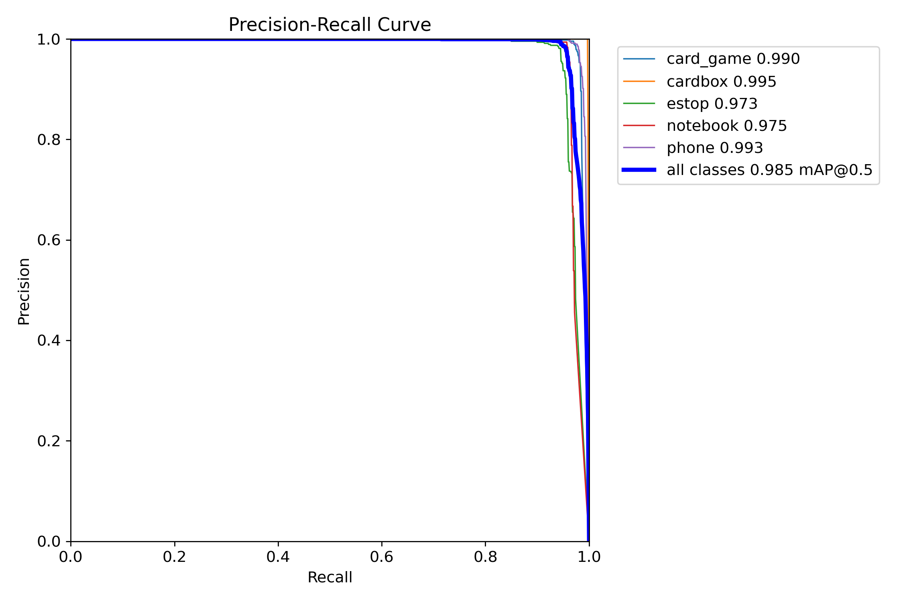
*Precision-Recall curve demonstrating 98.52% mAP@0.5*

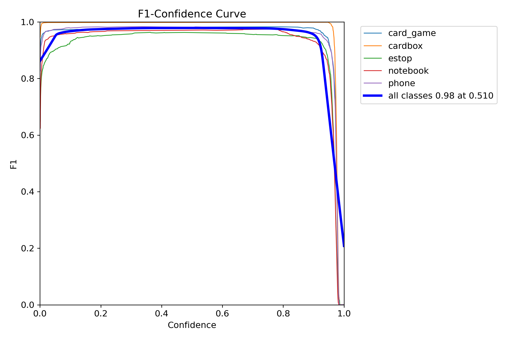
*F1-Confidence curve showing optimal confidence threshold at 0.511*

**Deployment Rationale:**
1. Objects match physical system (cardbox vs circuit_board availability)
2. Nearly identical performance to V2 (98.52% vs 98.6%)
3. Highest mAP@0.5-0.95 and precision
4. Production-ready with confirmed object availability

**Status:** Production deployment model

---

## Training Curves Comparison

### YOLOv5n V1 vs YOLOv8n V2/V3

**YOLOv5n V1 (100 epochs):**


**YOLOv8n V2 (50 epochs):**


**YOLOv8n V3 (50 epochs):**


**Key Observations:**
1. **Convergence Speed:**
   - YOLOv5n: Required 100 epochs to converge
   - YOLOv8n: Converged in 50 epochs (2× faster)

2. **Loss Curves:**
   - YOLOv5n: Slower decline, more fluctuation in early epochs
   - YOLOv8n: Smooth, rapid convergence with close-mosaic technique

3. **Validation Metrics:**
   - YOLOv5n: Recall plateaued at 89.8%
   - YOLOv8n: Recall reached 96-98%

4. **Precision:**
   - YOLOv5n: Achieved 99.9% precision (overfit?)
   - YOLOv8n: Balanced 98-99% precision

**Training Files:**
- YOLOv5n V1: `runs/detect/yolov5n_detect_V1/results.png`
- YOLOv8n V2: `runs/detect/yolov8n_detect_V2/results.png`
- YOLOv8n V3: `runs/detect/yolov8n_detect_V3/results.png`

---

## Architecture Comparison

### YOLOv5n vs YOLOv8n

| Feature | YOLOv5n | YOLOv8n |
|---------|---------|---------|
| **Release** | 2020 | 2023 |
| **Backbone** | CSPDarknet | CSPDarknet + C2f |
| **Training Efficiency** | 100 epochs needed | 50 epochs sufficient |
| **Precision** | 99.9% | 98-99% |
| **Recall** | 89.8% | 96-98% |
| **Background FPs** | 68 | 48 |
| **mAP@0.5** | 98.5% | 98.5-98.6% |

**YOLOv8n Advantages:**
1. **Faster Convergence:** C2f blocks improve gradient flow
2. **Better Recall:** Improved detection of difficult objects
3. **Lower False Positives:** Enhanced background discrimination
4. **More Balanced:** Avoids overfitting (precision not artificially high)

**Verdict:** YOLOv8n is superior architecture for this application

---

## Object Set Evolution

### V1 Object Set (Failed)
- game_box ✅
- headset ✅
- notebook ✅
- **repair_mat ❌** (low texture, 75.4% AP, 61% recall)
- wallet ✅

**Problem:** Repair_mat lacked sufficient texture for feature-based pose estimation

---

### V2 Object Set
- card_game ✅ (high texture, grid pattern)
- **circuit_board ✅** (high contrast features)
- estop ✅ (ArUco marker)
- notebook ✅ (grid pattern, high contrast)
- phone ✅ (ArUco marker)

**Status:** Best performance (98.6% mAP@0.5) but circuit_board unavailable in physical system

---

### V3 Object Set (Final/Deployed)
- card_game ✅ (high texture, grid pattern)
- **cardbox ✅** (replaced circuit_board, high contrast features)
- estop ✅ (ArUco marker)
- notebook ✅ (grid pattern, high contrast)
- phone ✅ (ArUco marker)

**Status:** Deployed - matches physical system availability

---

### YOLOv5n V1 Object Set
- Same as V3 (card_game, cardbox, estop, notebook, phone)
- Used to benchmark YOLOv5n vs YOLOv8n architecture

**Improvements from V1:**
- All objects meet texture requirements (15+ ORB keypoints)
- ArUco markers for objects without natural texture
- Diverse sizes (93mm to 240mm) for scale robustness

---

## Dataset Statistics

### YOLOv8n V1
- **Objects:** 5 (old set)
- **Instances:** ~13,000 (estimated)
- **Training Split:** Standard 80/10/10

### YOLOv5n V1
- **Objects:** 5 (final set)
- **Instances:** ~19,000
- **Training Split:** Standard split
- **Instance Distribution:**
  - card_game: 3,755
  - cardbox: 3,699
  - estop: 3,936
  - notebook: 3,927
  - phone: 3,889

### YOLOv8n V2/V3
- **Objects:** 5 (V2: circuit_board, V3: cardbox - other 4 same)
- **Instances:** ~24,000
- **Training Split:** 18,315 train / 2,289 val / 2,289 test
- **Instance Distribution (V3):**
  - cardbox: 4,621
  - phone: 4,865
  - card_game: 4,691
  - notebook: 4,908
  - estop: 4,925

**Key Insight:** V2 and V3 used different datasets (circuit_board vs cardbox) but achieved nearly identical performance (98.6% vs 98.52% mAP@0.5), demonstrating robust architecture. Both significantly outperformed YOLOv5n V1 with half the training time.

---

## False Positive Analysis

### Background Confusion by Model

| Model | Total Background FPs | Most Confused Class | Least Confused Class |
|-------|---------------------|---------------------|----------------------|
| YOLOv8n V1 | 256 | repair_mat (226 FPs) | multiple (8-10 FPs) |
| YOLOv5n V1 | 68 | estop (26 FPs) | cardbox (1 FP) |
| YOLOv8n V2 | 48 | estop (16 FPs) | phone (5 FPs) |
| YOLOv8n V3 | 48 | estop (16 FPs) | phone (5 FPs) |

**Pattern:** Estop (ArUco marker) consistently has highest background confusion, likely due to geometric marker detection false positives in structured environments.

**V1 Anomaly:** Repair_mat's 226 background FPs (88% of total) confirms object unsuitability for detection task.

---

## Recommendation Summary

### For Production Deployment: YOLOv8n V3

**Reasons:**
1. ✅ Object set matches physical system
2. ✅ Highest mAP@0.5-0.95 (97.19%)
3. ✅ Highest precision (98.98%)
4. ✅ Low false positives (48)
5. ✅ Efficient training (50 epochs)
6. ✅ Balanced performance across all classes

### For Experimentation: YOLOv8n V2

**Reasons:**
- Slightly higher mAP@0.5 (98.6% vs 98.52%)
- Lowest background confusion (48 FPs)
- Perfect precision/recall balance (98.0% each)
- Use if circuit_board is preferred over cardbox

### Avoid: YOLOv5n V1

**Reasons:**
- Requires 2× training time (100 epochs)
- Lower recall (89.8% vs 96-98%)
- Higher false positives (68 vs 48)
- YOLOv8n architecture is superior

### Never Use: YOLOv8n V1

**Reasons:**
- Failed object selection (repair_mat)
- Unacceptably high false positives (256)
- Poor object/background separation

---

## Training Configuration Comparison

### Common Parameters (All Models)
```yaml
batch: 32
imgsz: 640
patience: 10
optimizer: auto
seed: 0
deterministic: true
lr0: 0.01
lrf: 0.01
momentum: 0.937
weight_decay: 0.0005
```

### Model-Specific Differences

**YOLOv8n V1:**
```yaml
model: yolov8n.pt
epochs: 50
name: yolov8n_detect_V1
```

**YOLOv5n V1:**
```yaml
model: yolov5n.pt
epochs: 100  # Required longer training
name: yolov5n_detect_V1
```

**YOLOv8n V2:**
```yaml
model: yolov8n.pt
epochs: 50
name: yolov8n_detect_V2
```

**YOLOv8n V3:**
```yaml
model: yolov8n.pt
epochs: 50
name: yolov8n_detect_V3
data: DATA\data.yaml  # Final object set
```

---

## Lessons Learned

### 1. Object Selection is Critical
- Visual texture ≠ sufficient features for detection
- Pre-validate objects with suitability testing tool
- Failure of repair_mat led to complete object set revision

### 2. Architecture Matters
- YOLOv8n converges 2× faster than YOLOv5n
- Better precision/recall balance
- Lower false positives with same dataset

### 3. Dataset Quality > Quantity (to a point)
- 19K instances sufficient for 98%+ mAP
- Balanced class distribution more important than total size
- Proper object selection prevents wasted annotation effort

### 4. Background Confusion is Predictable
- ArUco markers consistently show higher FPs (geometric patterns)
- Low-texture objects (repair_mat) show extreme confusion
- Well-textured objects (cardbox) show minimal confusion

### 5. Training Efficiency
- YOLOv8n: 50 epochs = ~2-3 hours on RTX 40 series
- YOLOv5n: 100 epochs = ~4-6 hours on RTX 40 series
- Close_mosaic technique (last 10 epochs) improves final performance

---

## Future Work Recommendations

### Short-Term
1. **Export ONNX:** YOLOv8n V3 → ONNX for 10-15% speedup
2. **Quantization:** INT8 quantization for embedded deployment
3. **Model Pruning:** Reduce model size for faster inference

### Medium-Term
1. **Dataset Expansion:** Add more diverse backgrounds and lighting
2. **Occlusion Robustness:** Include partially occluded object samples
3. **Multi-Scale Training:** Improve detection at varying distances

### Long-Term
1. **Custom Architecture:** Explore YOLOv9/YOLOv10 when available
2. **Hardware Acceleration:** Optimize for Coral TPU or Jetson Nano
3. **Active Learning:** Continuously improve dataset from deployment data

---

## Model Files Location

### Trained Models
```
runs/detect/
├── yolov8n_detect_V1/
│   └── weights/best.pt
├── yolov5n_detect_V1/
│   └── weights/best.pt
├── yolov8n_detect_V2/
│   └── weights/best.pt
└── yolov8n_detect_V3/          # DEPLOYMENT MODEL
    └── weights/
        ├── best.pt              # PyTorch
        └── best.onnx            # ONNX (optional)
```

### Training Results
Each model folder contains:
- `results.png` - Training curves
- `results.csv` - Epoch-by-epoch metrics
- `confusion_matrix.png` - Validation confusion matrix
- `confusion_matrix_normalized.png` - Normalized version
- `BoxF1_curve.png`, `BoxP_curve.png`, `BoxPR_curve.png`, `BoxR_curve.png`
- `labels.jpg` - Dataset label distribution
- `args.yaml` - Training configuration

---

## Conclusion

**YOLOv8n V3** represents the optimal balance of accuracy, efficiency, and production readiness for the pose estimation detection system. The evolution from V1 (failed object selection) → V5n V1 (architectural baseline) → V2 (best performance) → V3 (production) demonstrates the importance of:

1. **Object selection** (repair_mat failure)
2. **Architecture choice** (YOLOv8n > YOLOv5n)
3. **Training efficiency** (50 vs 100 epochs)
4. **Production alignment** (object availability)

The final model achieves 98.52% mAP@0.5 with only 48 background false positives, enabling reliable real-time detection on Raspberry Pi 4 at 1.8-2.0 FPS when combined with adaptive frame skipping optimization.

---

**Document Version:** 1.0  
**Last Updated:** December 11, 2024  
**Author:** Oluwatunmise Raphael Shuaibu  
**Course:** PDE3802 - AI in Robotics  
**Institution:** Middlesex University London